|                                                                |
|:---------------------------------------------------------------|
| title: “Spatial Transcriptomics Analysis of Human Lung Tissue” |
| author: “Ankur Meshram”                                        |
| date: “2025-06-19”                                             |
| output: github_document                                        |

## Introduction

This project provides a full analysis pipeline for **spatial
transcriptomics** data using the **Visium** platform (10x Genomics) in a
public repository dataset, **GSE264233**. The dataset contains all the
gene expression matrices and corresponding microscopy images of the
tissue. Spatial transcriptomics allows for the examination of gene
expression in its native spatial context, which is an incredible
opportunity to investigate tissue architecture, cellular heterogeneity,
and disease microenvironments.

The purpose of this analysis was to visualize, preprocess, normalize,
and understand the gene expression landscape in human tissue samples
incorporating both spatial and transcriptomic data. To achieve this we
combined packages **Seurat**, **clusterProfiler**, and **enrichR** for
the end-to-end analysis.

The workflow includes the following steps: 1. Expression data
preparation 2. Visualization of tissue images 3. Spatial mapping of
barcode coordinates 4. Creating a Seurat object with spatial metadata 5.
Quality control and filtering 6. Normalization and dimensionality
reduction 7. Clustering and marker identification 8. Spatial
visualization of clusters 9. GO and KEGG pathway enrichment analysis

## Set the working directory and list data files

``` r
setwd("C:/Users/meshr/Downloads/spatial_transcriptomics")
list.files()
```

    ## [1] "GSE264233"                   "Readme.md"                   "spatial_transcriptomics.Rmd"

## Expression Profile Preparation

``` r
# Load required packages
library(data.table)
library(Matrix)

# Load raw data
barcodes <- fread("GSE264233/barcodes.tsv", header = FALSE)
features <- fread("GSE264233/features.tsv", header = FALSE)
matrix <- Matrix::readMM("GSE264233/matrix.mtx")

# Create expression profile
expr_mat <- matrix
rownames(expr_mat) <- make.unique(features$V2)
colnames(expr_mat) <- barcodes$V1
expr_mat <- as.matrix(expr_mat)
expr_df <- as.data.frame(expr_mat)
expr_df[1:5, 1:5]
```

    ##         AAACCGGGTAGGTACC-1 AAACCGTTCGTCCAGG-1 AAACCTCATGAAGTTG-1 AAACGAGACGGTTGAT-1 AAACGGTTGCGAACTG-1
    ## SAMD11                   0                  1                  0                  0                  0
    ## NOC2L                    1                  0                  0                  0                  1
    ## KLHL17                   0                  1                  0                  0                  0
    ## PLEKHN1                  0                  0                  0                  0                  0
    ## PERM1                    0                  0                  0                  0                  0

## Visualizing Histological Tissue Images

``` r
# Load required packages
library(magick)
library(grid)
library(gridExtra)

# Load all images
img1 <- image_read("GSE264233/GSM8208231_D1_aligned_fiducials.jpg")
img2 <- image_read("GSE264233/GSM8208231_D1_detected_tissue_image.jpg")
img3 <- image_read("GSE264233/GSM8208231_D1_tissue_hires_image.png")
img4 <- image_read("GSE264233/GSM8208231_D1_tissue_lowres_image.png")

# Visualize the images
g1 <- rasterGrob(as.raster(img1), interpolate = TRUE)
g2 <- rasterGrob(as.raster(img2), interpolate = TRUE)
g3 <- rasterGrob(as.raster(img3), interpolate = TRUE)
g4 <- rasterGrob(as.raster(img4), interpolate = TRUE)
grid.arrange(g1, g2, g3, g4, ncol = 2, top = "Spatial Transcriptomics Images")
```

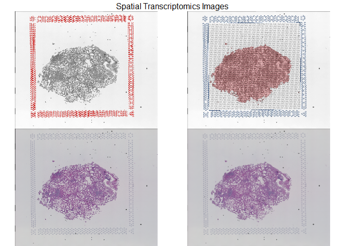<!-- -->

## Plot Tissue Map Using Barcode Coordinates

``` r
# Load required packages
library(dplyr)
library(ggplot2)

expr_barcodes <- colnames(expr_df)
coords <- read.csv("GSE264233/GSM8208231_D1_tissue_positions_list.csv")
matched_coords <- coords %>% filter(barcode %in% expr_barcodes)

ggplot(matched_coords, aes(x = pxl_col_in_fullres, y = pxl_row_in_fullres)) +
  geom_point(color = "blue", size = 1) +
  scale_y_reverse() +
  coord_fixed() +
  theme_minimal() +
  labs(title = "Tissue Plot Using Barcode Coordinates",
       x = "Pixel Column (x)", y = "Pixel Row (y)")
```

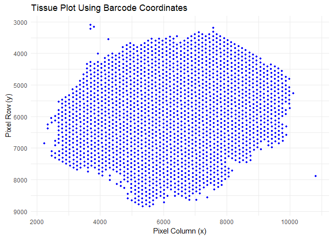<!-- -->

## Create Seurat Object with Spatial Info

``` r
library(Seurat)
seurat_obj <- CreateSeuratObject(counts = expr_df, assay = "Spatial")
```

    ## Warning: Data is of class data.frame. Coercing to dgCMatrix.

``` r
seurat_obj@meta.data <- cbind(seurat_obj@meta.data, coords[Cells(seurat_obj), ])
```

## QC and Filtering

``` r
# The data is already filtered and it does not have mitochondrial, ribosomal and chloroplast genes.
VlnPlot(seurat_obj, features = c("nFeature_Spatial", "nCount_Spatial"), ncol = 2)
```

    ## Warning: Default search for "data" layer in "Spatial" assay yielded no results; utilizing "counts" layer instead.

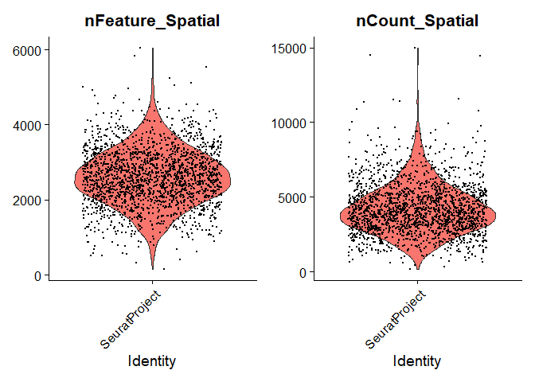<!-- -->

``` r
FeatureScatter(seurat_obj, feature1 = "nCount_Spatial", feature2 = "nFeature_Spatial")
```

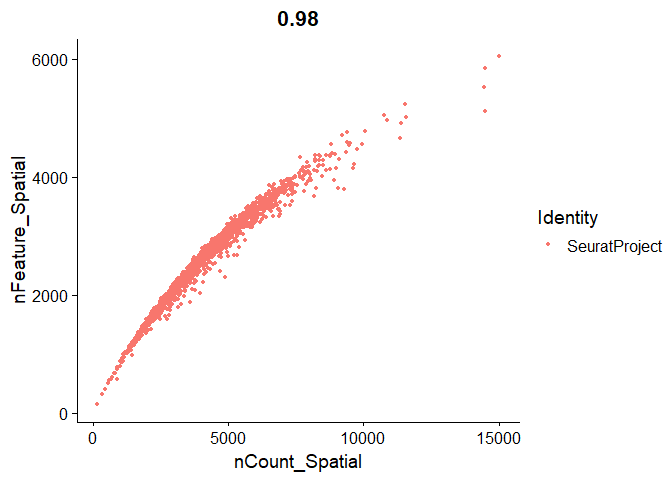<!-- -->

``` r
# filtering
seurat_obj <- subset(seurat_obj,
                     subset = nFeature_Spatial > 200 &
                              nFeature_Spatial < 7000)
```

## Normalization and Dimensionality Reduction

``` r
seurat_obj <- suppressWarnings(SCTransform(seurat_obj, assay = "Spatial", verbose = TRUE))
```

    ## Running SCTransform on assay: Spatial

    ## vst.flavor='v2' set. Using model with fixed slope and excluding poisson genes.

    ## `vst.flavor` is set to 'v2' but could not find glmGamPoi installed.
    ## Please install the glmGamPoi package for much faster estimation.
    ## --------------------------------------------
    ## install.packages('BiocManager')
    ## BiocManager::install('glmGamPoi')
    ## --------------------------------------------
    ## Falling back to native (slower) implementation.

    ## Calculating cell attributes from input UMI matrix: log_umi

    ## Variance stabilizing transformation of count matrix of size 14405 by 1976

    ## Model formula is y ~ log_umi

    ## Get Negative Binomial regression parameters per gene

    ## Using 2000 genes, 1976 cells

    ## Found 19 outliers - those will be ignored in fitting/regularization step

    ## Second step: Get residuals using fitted parameters for 14405 genes

    ## Computing corrected count matrix for 14405 genes

    ## Calculating gene attributes

    ## Wall clock passed: Time difference of 2.681054 mins

    ## Determine variable features

    ## Centering data matrix

    ## Place corrected count matrix in counts slot

    ## Set default assay to SCT

``` r
seurat_obj <- RunPCA(seurat_obj, verbose = FALSE)
seurat_obj <- RunUMAP(seurat_obj, dims = 1:30)
```

    ## 19:17:47 UMAP embedding parameters a = 0.9922 b = 1.112

    ## 19:17:47 Read 1976 rows and found 30 numeric columns

    ## 19:17:47 Using Annoy for neighbor search, n_neighbors = 30

    ## 19:17:47 Building Annoy index with metric = cosine, n_trees = 50

    ## 0%   10   20   30   40   50   60   70   80   90   100%

    ## [----|----|----|----|----|----|----|----|----|----|

    ## **************************************************|
    ## 19:17:48 Writing NN index file to temp file C:\Users\meshr\AppData\Local\Temp\RtmpEf2Y9q\file5b2c15d94d2
    ## 19:17:48 Searching Annoy index using 1 thread, search_k = 3000
    ## 19:17:48 Annoy recall = 100%
    ## 19:17:49 Commencing smooth kNN distance calibration using 1 thread with target n_neighbors = 30
    ## 19:17:51 Initializing from normalized Laplacian + noise (using RSpectra)
    ## 19:17:51 Commencing optimization for 500 epochs, with 87166 positive edges
    ## 19:17:51 Using rng type: pcg
    ## 19:17:56 Optimization finished

``` r
DimPlot(seurat_obj, reduction = "umap", label = TRUE) 
```

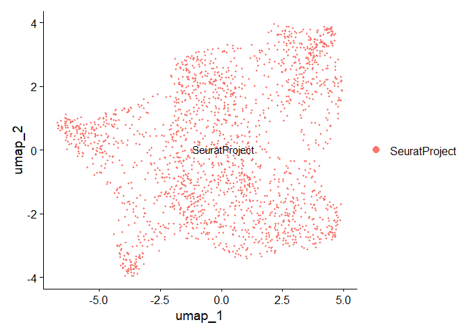<!-- -->

``` r
DimPlot(seurat_obj, reduction = "pca", label = TRUE)
```

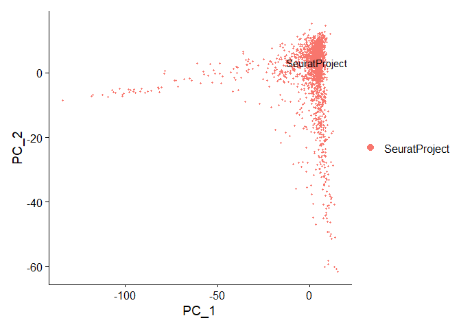<!-- -->

## Clustering and Identifying Cluster Markers

``` r
seurat_obj <- FindNeighbors(seurat_obj, dims = 1:30)
```

    ## Computing nearest neighbor graph

    ## Computing SNN

``` r
seurat_obj <- FindClusters(seurat_obj, resolution = 0.5)
```

    ## Modularity Optimizer version 1.3.0 by Ludo Waltman and Nees Jan van Eck
    ## 
    ## Number of nodes: 1976
    ## Number of edges: 82203
    ## 
    ## Running Louvain algorithm...
    ## Maximum modularity in 10 random starts: 0.7765
    ## Number of communities: 7
    ## Elapsed time: 0 seconds

``` r
DimPlot(seurat_obj, reduction = "umap", group.by = "seurat_clusters", label = TRUE) 
```

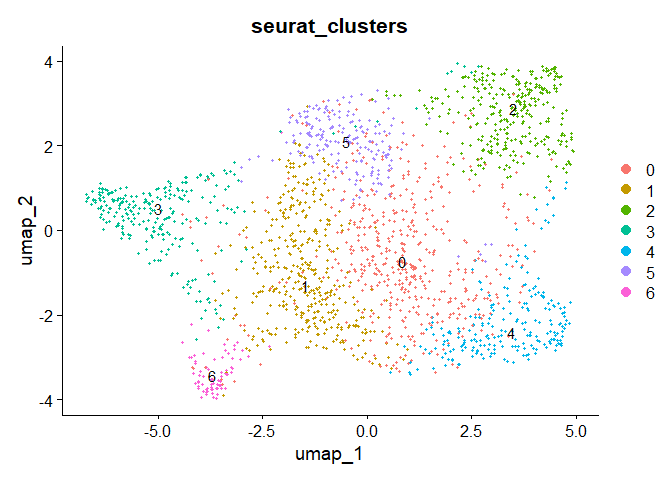<!-- -->

``` r
DimPlot(seurat_obj, reduction = "pca", group.by = "seurat_clusters", label = TRUE)
```

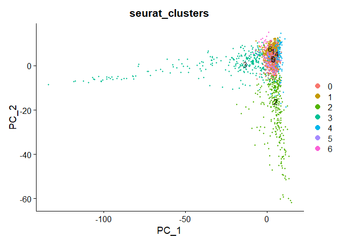<!-- -->

``` r
cluster_markers <- FindAllMarkers(seurat_obj, only.pos = TRUE, min.pct = 0.25, logfc.threshold = 0.25)
```

    ## Calculating cluster 0

    ## Calculating cluster 1

    ## Calculating cluster 2

    ## Calculating cluster 3

    ## Calculating cluster 4

    ## Calculating cluster 5

    ## Calculating cluster 6

``` r
head(cluster_markers)
```

    ##               p_val avg_log2FC pct.1 pct.2    p_val_adj cluster   gene
    ## COL4A1 4.699950e-41  0.5403731 0.998 0.957 6.770278e-37       0 COL4A1
    ## CCN2   1.022690e-25  0.3869224 1.000 0.982 1.473185e-21       0   CCN2
    ## CAVIN1 4.624828e-25  0.3868038 0.992 0.954 6.662065e-21       0 CAVIN1
    ## COL4A2 6.703369e-20  0.4953495 0.927 0.793 9.656203e-16       0 COL4A2
    ## LBH    2.174039e-17  0.3517667 0.976 0.925 3.131703e-13       0    LBH
    ## PTGDS  8.198370e-17  0.3520453 0.992 0.931 1.180975e-12       0  PTGDS

``` r
# top markers from each cluster
FeaturePlot(seurat_obj, features = c("COL4A1", "A2M", "CTSD", "SCGB1A1", "COL3A1", "SFTPB", "ACTA2"), ncol = 2)
```

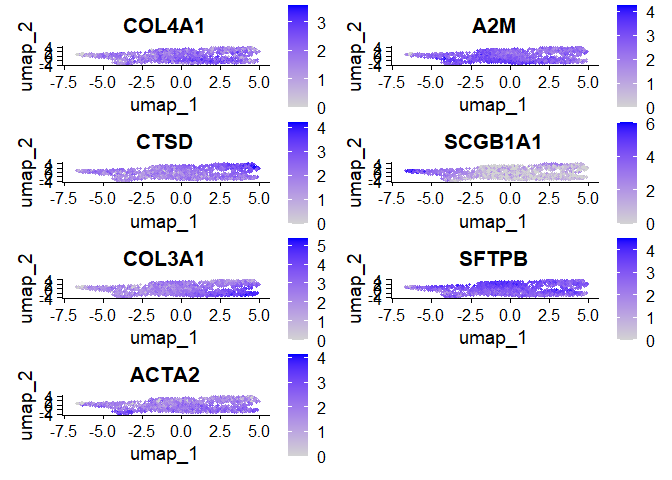<!-- -->

## Spatial Visualization of Clusters

``` r
library(jpeg)
library(png)
library(patchwork)
library(jsonlite)

coords <- coords[coords$barcode %in% colnames(seurat_obj), ]
image_info <- data.frame(
  row = coords$array_row,
  col = coords$array_col,
  tissue = coords$in_tissue,
  imagerow = coords$pxl_row_in_fullres,
  imagecol = coords$pxl_col_in_fullres,
  stringsAsFactors = FALSE
)
rownames(image_info) <- coords$barcode

scale_json <- fromJSON("GSE264233/GSM8208231_D1_scalefactors_json.json")
sf <- scalefactors(
  spot = scale_json$spot_diameter_fullres,
  fiducial = scale_json$fiducial_diameter_fullres,
  hires = scale_json$tissue_hires_scalef,
  lowres = scale_json$tissue_lowres_scalef
)

fullres_img <- readJPEG("GSE264233/GSM8208231_D1_detected_tissue_image.jpg")
fiducial_img <- readJPEG("GSE264233/GSM8208231_D1_aligned_fiducials.jpg")
hires_img <- readPNG("GSE264233/GSM8208231_D1_tissue_hires_image.png")
lowres_img <- readPNG("GSE264233/GSM8208231_D1_tissue_lowres_image.png")

seurat_obj@images[["fullres"]] <- new("VisiumV1", image = fullres_img, scale.factors = sf, coordinates = image_info)
seurat_obj@images[["fiducial"]] <- new("VisiumV1", image = fiducial_img, scale.factors = sf, coordinates = image_info)
seurat_obj@images[["hires"]] <- new("VisiumV1", image = hires_img, scale.factors = sf, coordinates = image_info)
seurat_obj@images[["lowres"]] <- new("VisiumV1", image = lowres_img, scale.factors = sf, coordinates = image_info)

p1 <- SpatialPlot(seurat_obj, images = "fullres", label = TRUE, pt.size.factor = 1.2) + ggtitle("Full Resolution")
```

    ## Scale for fill is already present.
    ## Adding another scale for fill, which will replace the existing scale.

``` r
p2 <- SpatialPlot(seurat_obj, images = "hires", label = TRUE, pt.size.factor = 1.2) + ggtitle("High Resolution")
```

    ## Scale for fill is already present.
    ## Adding another scale for fill, which will replace the existing scale.

``` r
p3 <- SpatialPlot(seurat_obj, images = "lowres", label = TRUE, pt.size.factor = 1.2) + ggtitle("Low Resolution")
```

    ## Scale for fill is already present.
    ## Adding another scale for fill, which will replace the existing scale.

``` r
p4 <- SpatialPlot(seurat_obj, images = "fiducial", label = TRUE, pt.size.factor = 1.2) + ggtitle("Aligned Fiducials")
```

    ## Scale for fill is already present.
    ## Adding another scale for fill, which will replace the existing scale.

``` r
(p1 | p2) / (p3 | p4)
```

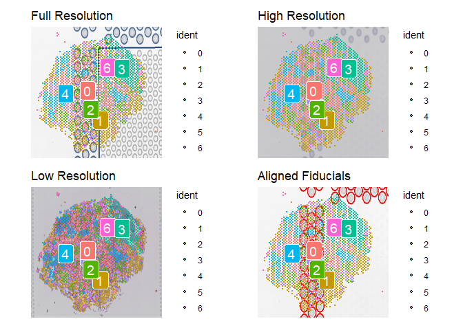<!-- -->

## Gene Ontology (GO) Analysis

``` r
library(clusterProfiler)
library(org.Hs.eg.db)
library(enrichplot)

# Top genes from cluster 0
top_genes <- cluster_markers %>% filter(cluster == 0) %>% top_n(n = 100, wt = avg_log2FC)

gene_symbols <- top_genes$gene
entrez_ids <- bitr(gene_symbols, fromType = "SYMBOL", toType = "ENTREZID", OrgDb = org.Hs.eg.db)
```

    ## 'select()' returned 1:1 mapping between keys and columns

    ## Warning in bitr(gene_symbols, fromType = "SYMBOL", toType = "ENTREZID", : 2% of input gene IDs are fail to map...

``` r
ego <- enrichGO(gene = entrez_ids$ENTREZID,
                OrgDb = org.Hs.eg.db,
                keyType = "ENTREZID",
                ont = "BP",
                pAdjustMethod = "BH",
                qvalueCutoff = 0.05)

dotplot(ego, showCategory = 20) 
```

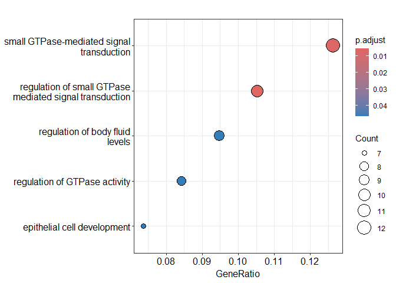<!-- -->

``` r
barplot(ego, showCategory = 20, title = "GO Biological Process")
```

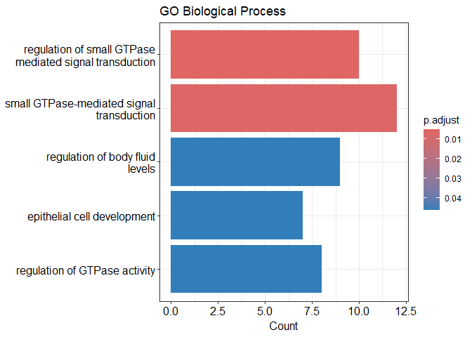<!-- -->

``` r
emapplot(pairwise_termsim(ego), showCategory = 30) 
```

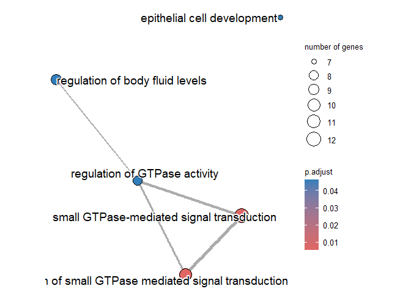<!-- -->

``` r
cnetplot(ego, categorySize = "pvalue", foldChange = NULL)
```

    ## Warning in cnetplot.enrichResult(x, ...): Use 'color.params = list(foldChange = your_value)' instead of 'foldChange'.
    ##  The foldChange parameter will be removed in the next version.

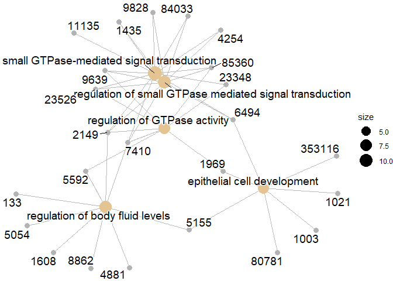<!-- -->

## KEGG Pathway Enrichment Analysis

``` r
ekegg <- enrichKEGG(gene = entrez_ids$ENTREZID,
                    organism = 'hsa',
                    pvalueCutoff = 0.05)
```

    ## Reading KEGG annotation online: "https://rest.kegg.jp/link/hsa/pathway"...

    ## Reading KEGG annotation online: "https://rest.kegg.jp/list/pathway/hsa"...

``` r
dotplot(ekegg, showCategory = 20) 
```

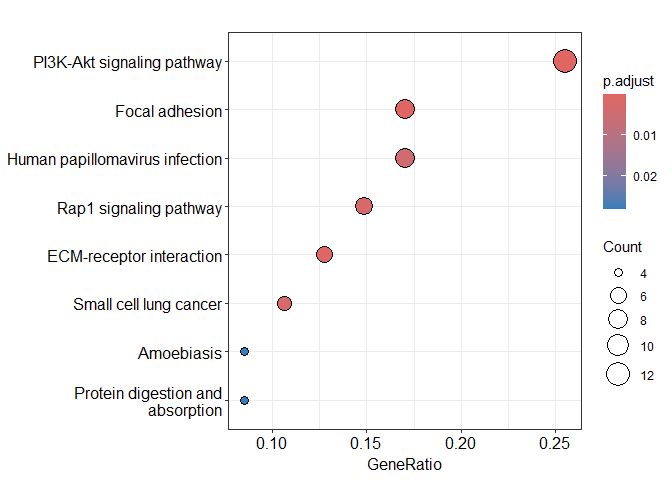<!-- -->

``` r
barplot(ekegg, showCategory = 20, title = "KEGG Pathways")
```

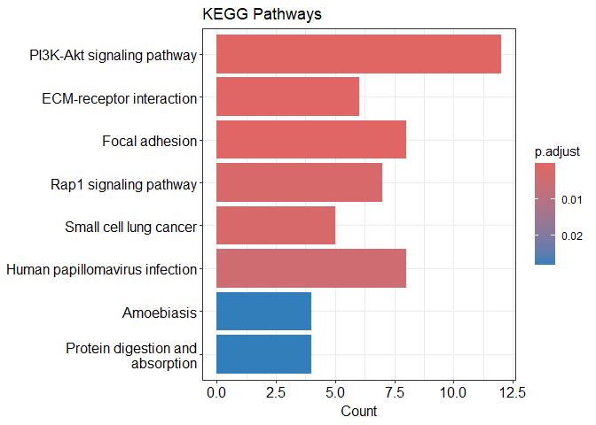<!-- -->

``` r
ekegg_sim <- pairwise_termsim(ekegg)
emapplot(ekegg_sim, showCategory = 30)
```

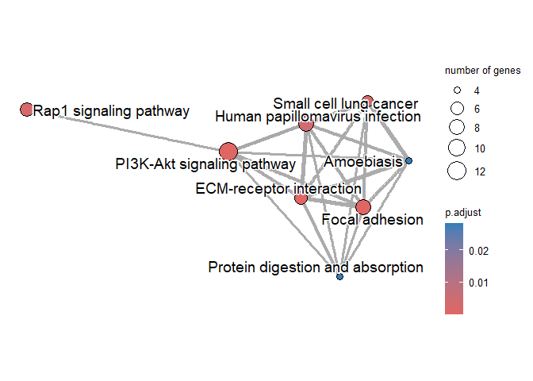<!-- -->

``` r
cnetplot(ekegg, categorySize = "pvalue", foldChange = NULL)
```

    ## Warning in cnetplot.enrichResult(x, ...): Use 'color.params = list(foldChange = your_value)' instead of 'foldChange'.
    ##  The foldChange parameter will be removed in the next version.

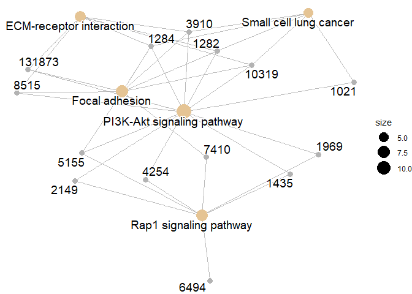<!-- -->

``` r
# Module Enrichment Analysis
mkegg <- enrichMKEGG(gene = entrez_ids$ENTREZID,
            organism = "hsa",
            keyType = "kegg",
            pvalueCutoff = 0.05,
            pAdjustMethod = "BH")
```

    ## Reading KEGG annotation online: "https://rest.kegg.jp/link/hsa/module"...

    ## Reading KEGG annotation online: "https://rest.kegg.jp/list/module"...

``` r
mkegg@result
```

    ##            ID                                               Description GeneRatio BgRatio RichFactor FoldEnrichment
    ## M00036 M00036 Leucine degradation, leucine => acetoacetate + acetyl-CoA       1/2  13/889 0.07692308       34.19231
    ## M00154 M00154                                      Cytochrome c oxidase       1/2  24/889 0.04166667       18.52083
    ##          zScore     pvalue   p.adjust     qvalue geneID Count
    ## M00036 5.721590 0.02904873 0.05329401 0.02804948    594     1
    ## M00154 4.129638 0.05329401 0.05329401 0.02804948  84701     1

## KEGG Enrichment Using Enrichr

``` r
library(enrichR)
dbs_to_use <- c("GO_Biological_Process_2021", "KEGG_2021_Human")
enriched <- enrichr(top_genes$gene, dbs_to_use)
```

    ## Uploading data to Enrichr... Done.
    ##   Querying GO_Biological_Process_2021... Done.
    ##   Querying KEGG_2021_Human... Done.
    ## Parsing results... Done.

``` r
enrichr_kegg <- enriched[["KEGG_2021_Human"]]
enrichR::plotEnrich(enrichr_kegg, showTerms = 20, numChar = 40, y = "P.value")
```

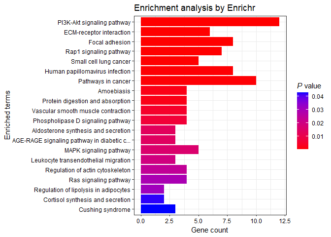<!-- -->

``` r
top_terms <- enrichr_kegg[1:20, ]
top_terms$Term <- factor(top_terms$Term, levels = rev(top_terms$Term))

ggplot(top_terms, aes(x = Combined.Score, y = Term)) +
  geom_point(aes(size = -log10(P.value), color = Adjusted.P.value)) +
  scale_color_gradient(low = "red", high = "blue") +
  theme_minimal() +
  labs(title = "KEGG Enrichment (enrichR)", x = "Combined Score", y = "") +
  theme(axis.text.y = element_text(size = 10))
```

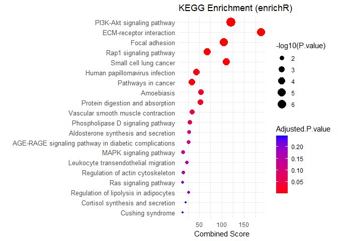<!-- -->
